  

<picture>
  <source media="(prefers-color-scheme: dark)" srcset="https://raw.githubusercontent.com/ar-0911/ar-0911/output/snake-dark.svg" />
  
</picture>

B.Tech CS (Bioinformatics), VIT Vellore · CGPA 9.53 · ex-NUS Singapore academic intern

